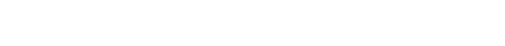

<!--suppress HtmlDeprecatedAttribute, HtmlUnknownTarget -->
<div align="center">
  <!--
  =====================
         HEADER
  =====================
  -->
  <br />
  <a rel="noopener noreferrer" href="https://github.com/OctalMesh/Commodore">
    <picture>
      <source media="(prefers-color-scheme: light)" srcset="./.github/assets/svg/commodore_logo_inside.svg">
      
    </picture>
  </a>
  <br /><br /><br />
  <!--
  =====================
         BADGES
  =====================
  -->
  <div>
    <!-- Repo Stars Badge -->
    <a rel="noopener noreferrer" href="https://github.com/OctalMesh/Commodore/stargazers">
      <picture>
        <source media="(prefers-color-scheme: light)" srcset="https://img.shields.io/github/stars/OctalMesh/Commodore?style=for-the-badge&logo=starship&color=363636&labelColor=464646" />
        
      </picture>
    </a>
    <!-- Repo Contributors Badge -->
    <a rel="noopener noreferrer" href="https://github.com/OctalMesh/Commodore/contributors">
      <picture>
        <source media="(prefers-color-scheme: light)" srcset="https://img.shields.io/github/contributors/OctalMesh/Commodore?style=for-the-badge&logo=githubsponsors&logoColor=fff&color=363636&labelColor=464646" />
        
      </picture>
    </a>
    <!-- Version Badge -->
    <a rel="noopener noreferrer" href="https://github.com/OctalMesh/Commodore/releases/latest">
      <picture>
        <source media="(prefers-color-scheme: light)" srcset="https://img.shields.io/github/v/release/OctalMesh/Commodore?style=for-the-badge&color=363636&labelColor=464646&logo=data:image/svg%2bxml;base64,PHN2ZyB4bWxucz0iaHR0cDovL3d3dy53My5vcmcvMjAwMC9zdmciIHdpZHRoPSIxNiIgaGVpZ2h0PSIxNiI+PHBhdGggZmlsbD0iI2ZmZiIgZD0iTTEgNy44di01UTEuMiAxLjIgMi44IDFoNXEuNyAwIDEuMi41bDYuMyA2LjNhMiAyIDAgMCAxIDAgMi40bC01IDVhMiAyIDAgMCAxLTIuNSAwTDEuNSA5QTIgMiAwIDAgMSAxIDcuOG0xLjUgMFY4bDYuMyA2LjJoLjRsNS01di0uNEw4IDIuNmwtLjItLjFoLTVsLS4zLjNaTTYgNWExIDEgMCAxIDEgMCAyIDEgMSAwIDAgMSAwLTIiLz48L3N2Zz4=" />
        
      </picture>
    </a>
    <br />
    <!-- Repo Views Badge -->
    <a rel="noopener noreferrer" href="https://hits.sh/github.com/OctalMesh/Commodore">
      <picture>
        <source media="(prefers-color-scheme: light)" srcset="https://hits.sh/github.com/OctalMesh/Commodore.svg?style=for-the-badge&label=Views&logo=github&color=363636&labelColor=464646" />
        
      </picture>
    </a>
    <!-- Go Version Badge -->
    <a rel="noopener noreferrer" href="https://go.dev/">
      <picture>
        <source media="(prefers-color-scheme: light)" srcset="https://img.shields.io/badge/Go-1.26-363636?style=for-the-badge&logo=go&logoColor=fff&labelColor=464646" />
        
      </picture>
    </a>
    <!-- License Badge -->
    <a rel="noopener noreferrer" href="LICENSE.md">
      <picture>
        <source media="(prefers-color-scheme: light)" srcset="https://img.shields.io/github/license/OctalMesh/Commodore?style=for-the-badge&color=363636&labelColor=464646&logo=data:image/svg%2bxml;base64,PHN2ZyB4bWxucz0iaHR0cDovL3d3dy53My5vcmcvMjAwMC9zdmciIHdpZHRoPSIxNiIgaGVpZ2h0PSIxNiI+PHBhdGggZmlsbD0iI2ZmZiIgZD0iTTguOC44VjJoMXEuMyAwIC44LjJsMS4zLjhoMi40YS44LjggMCAwIDEgMCAxLjVoLS41TDE2IDkuMmExIDEgMCAwIDEtLjEuOGwtLjUtLjUuNS41di4xbC0uOC40cS0uNi41LTIgLjVhNSA1IDAgMCAxLTItLjVsLS43LS40YTEgMSAwIDAgMS0uMi0xbDItNC42cS0uNiAwLTEtLjJMMTAgMy41SDguN1YxM2gyLjZhLjguOCAwIDAgMSAwIDEuNUg0LjhhLjguOCAwIDAgMSAwLTEuNWgyLjVWMy41SDZMNSA0LjNsLTEgLjIgMiA0LjdhMSAxIDAgMCAxLS4xLjhsLS41LS41LjUuNXYuMWwtLjguNHEtLjYuNS0yIC41YTUgNSAwIDAgMS0yLS41bC0uNy0uNEExIDEgMCAwIDEgMCA5bDItNC42aC0uNGEuOC44IDAgMCAxIDAtMS41aDIuNGwxLjMtLjguOS0uMmgxVi44YS44LjggMCAwIDEgMS41IDBtMi45IDguNHEuNC4zIDEuMy4zYy45IDAgMS0uMSAxLjMtLjNMMTMgNi4zWm0tMTAgMHEuNC4zIDEuMy4zYy45IDAgMS0uMSAxLjMtLjNMMyA2LjNaIi8+PC9zdmc+" />
        
      </picture>
    </a>
  </div>
  <h1></h1>
  <!--
  =====================
         SOURCES
  =====================
  -->
  <h6>
    <br />
    <a rel="noopener noreferrer" href="CODE_OF_CONDUCT.md">Code of Conduct</a>
    ·
    <a rel="noopener noreferrer" href="CONTRIBUTING.md">Contributing</a>
    ·
    <a rel="noopener noreferrer" href="SECURITY.md">Security Policy</a>
    ·
    <a rel="noopener noreferrer" href="SUPPORT.md">Support</a>
    ·
    <a rel="noopener noreferrer" href="LICENSE.md">License</a>
    ·
    <a rel="noopener noreferrer" href="examples/README.md">Examples</a>
  </h6>
</div>
<div align="justify">
  <!--
  =====================
       DESCRIPTION
  =====================
  -->
  <p>
    Commodore is a role-driven CLI engine and Go SDK for building and
    orchestrating OctalMesh projects from a <code>.commodore</code>
    configuration. It models your infrastructure as a naval fleet - squadrons
    recursively orchestrate subordinates, units execute atomic processes - all
    wired together by a DAG-based boot order with health checks, environment
    cascading, and live TUI feedback.
  </p>
</div>

<div align="center">
  <!--
  =====================
        ACTIVITY
  =====================
  -->
  <br />
  <a rel="noopener noreferrer" href="https://github.com/OctalMesh/Commodore/pulse">
    
  </a>
  <br /><br />
</div>

<div align="center">
  <h2>Overview</h2>
</div>

Commodore solves the problem of orchestrating complex, multiservice projects
where services have strict startup dependencies, heterogeneous runtimes, and
environment-specific configurations.

| Concept      | Description                                                                                                               |
|--------------|---------------------------------------------------------------------------------------------------------------------------|
| **Squadron** | A recursive orchestrator node. Manages other squadrons or units, cascades environments, defines boot order via a manifest |
| **Unit**     | An atomic execution leaf. Defines how a single service is built, started, and kept healthy                                |
| **Reactor**  | The runtime backend powering a node (`tilt` or `native`)                                                                  |
| **Maneuver** | A named, executable action (`lint`, `test`, `deploy`, ...) defined per node and exposed as a CLI subcommand               |
| **DAG**      | Directed Acyclic Graph computed from `after:` dependencies - guarantees correct startup and shutdown order                |

> [!NOTE]
> Commodore reads `.commodore[.yaml|.yml]` from the current directory by
> default. Override with `--config`.

<div align="center">
  <h2>Installation</h2>
</div>

### Using the bootstrap Admiral script

```bash
# Linux / macOS
bash admiral.sh

# Windows (PowerShell)
.\admiral.ps1
```

### Build from source

```bash
go build -o commodore ./cmd/commodore
```

### Go install

```bash
go install github.com/OctalMesh/Commodore/cmd/commodore@latest
```

<div align="center">
  <h2>Admiral</h2>
</div>

Admiral is the universal build and install script for Commodore and any custom
CLI built on top of the Go SDK. It handles cross-platform builds, binary
installation, alias linking, and automatic PATH management on Linux, macOS, and
Windows.

### Commands

| Command     | Description                                                     |
|-------------|-----------------------------------------------------------------|
| `install`   | Build and install a CLI binary, with optional aliases           |
| `build`     | Cross-compile binaries for all platforms to an output directory |
| `uninstall` | Remove an installed binary and its aliases                      |
| `lint`      | Run `golangci-lint` via `go tool` from the module root          |
| `help`      | Show usage information                                          |

### Global Flags

| Flag            | Short | Env var               | Description                |
|-----------------|-------|-----------------------|----------------------------|
| `--env <path>`  | `-e`  | -                     | Load a custom dotenv file  |
| `--name <name>` | `-n`  | `ADMIRAL_BINARY_NAME` | Binary name override       |
| `--src <path>`  | `-s`  | `ADMIRAL_SOURCE_DIR`  | Source path override       |
| `--out <path>`  | `-o`  | `ADMIRAL_BUILD_DIR`   | Build output directory     |
| `--dir <path>`  | `-d`  | `ADMIRAL_INSTALL_DIR` | Install directory override |

### Environment Variables

| Variable              | Default           | Description                  |
|-----------------------|-------------------|------------------------------|
| `ADMIRAL_BINARY_NAME` | `commodore`       | Primary binary name          |
| `ADMIRAL_SOURCE_DIR`  | current directory | Default source path          |
| `ADMIRAL_BUILD_DIR`   | `./build`         | Cross-build output directory |
| `ADMIRAL_INSTALL_DIR` | `~/.local/bin`    | Destination directory        |

Variables can be set in `.env` or `.env.example` at the project root. Flag
values always take the highest priority.

**Value precedence (lowest -> highest):**

1. Built-in script defaults
2. .env.example
3. .env
4. Custom file passed via --env/-e
5. CLI flags  (-n/--name, -s/--src, -o/--out, -d/--dir)

### Build target resolution

Admiral looks for `main.go` in this order:

1. `<src>/main.go` - single-binary project
2. `<src>/cmd/<name>/main.go` - standard multi-command layout

> [!IMPORTANT]
> The `--name` value (or `ADMIRAL_BINARY_NAME`) must match the directory name
> under `cmd/`. This is how Admiral locates what to build.

### Usage examples
```bash
# Install with default settings (reads .env / .env.example)
admiral install

# Install with a custom name and aliases
admiral install --name myapp --alias app

# Uninstall binary and aliases
admiral uninstall --name myapp --alias app

# Cross-compile for all platforms into ./dist
admiral build --name myapp --out ./dist

# Lint from module root
admiral lint
```

### Run locally

Linux / macOS:
```bash
bash admiral.sh
```

Windows (PowerShell):
```powershell
.\admiral.ps1
```

### Run from the network

Linux / macOS (requires `curl`):
```bash
curl -fsSL https://raw.githubusercontent.com/OctalMesh/Commodore/refs/heads/release/admiral.sh | bash
```

Windows (PowerShell):
```powershell
& ([scriptblock]::Create((irm https://raw.githubusercontent.com/OctalMesh/Commodore/refs/heads/release/admiral.ps1)))
```

> [!TIP]
> Running from the network is the recommended onboarding flow for custom CLIs -
> ship your own Admiral URL in your project's README and users get a one-liner
> install.

<div align="center">
  <h2>Configuration</h2>
</div>

Commodore discovers configuration by looking for `.commodore[.yaml|.yml]` in the
working directory. A project hierarchy is built by nesting squadron configs that
reference subordinate paths.

For units started directly from their own directory (standalone mode), Commodore
first tries `reactor.standalone.*` and then falls back to `reactor.*`.

### Squadron

A **squadron** is a recursive orchestrator - it manages other squadrons or units
via a `manifest`.

<details>
  <summary><strong>Squadron .commodore.yaml example</strong></summary>

```yaml
# ============================================================================ #
#                             Squadron Commander                               #
# ============================================================================ #
# Role: squadron | The recursive orchestrator node.                            #
# Manages tactical groups and inter-unit synchronization.                      #
# ============================================================================ #

role:   squadron      # Defines the role of this config as a squadron commander
id:     root-division # Unique identifier for this squadron (must be unique across the manifest)
binary: custom        # Optional: Custom binary for this squadron to execute (defaults to 'commodore')

# ============================================================================ #
#                            Reactor Configuration                             #
# ============================================================================ #
# Defines the reactor provider and its configuration for live updates,         #
# orchestration, and environment management across the squadron.               #
# ============================================================================ #

reactor:
  provider: tilt           # Specifies Tilt as the reactor provider for live updates and orchestration
  network:  commodore-mesh # Optional: Custom network for inter-unit communication
  context:  ./             # Optional: Build context for the reactor

  # Optional: Define the reactor configuration, such as the path to the Tiltfile
  # and any additional settings needed for the reactor to function properly.
  blueprints:
    - env:  dev             # Optional: Name of the environment this blueprint applies to
      path: ./dev/Tiltfile  # Path to the configuration file

    - env:  staging
      path: ./staging/Tiltfile

  # Optional: Define environment variables for the whole squadron, accessible to
  # all units and sub-squadrons.
  environments:
    - name: dev               # Name of the environment
      files:                  # Optional: Load environment variables from a file for this environment
        - ./dev/.env
      variables:              # Optional: Define environment variables specific to this environment
        - LOG_LEVEL=DEBUG
        - SOME_VAR=some_value

    - name: staging
      files:
        - ./staging/.env
      variables:
        - LOG_LEVEL=INFO
        - SOME_VAR=some_other_value

# ============================================================================ #
#                                Fleet Manifest                                #
# ============================================================================ #
# The Manifest defines the hierarchy. Every path leads to another config.      #
# No explicit roles needed here, each subordinate declares itself.             #
# ============================================================================ #

manifest:
  - id:   sqd-frontend       # Unique identifier for the subordinate squadron
    path: ./modules/frontend # Points to a squadron directory (can also point to .yaml, without certain folder)

    # Optional: Define tags for this squadron, which can be used for grouping
    # and dependency management across the manifest.
    tags:
      - "frontend"
      - "client"

    # Optional: Define dependencies for this squadron, ensuring it starts after
    # specified subordinates are healthy and running.
    after:
      - $tag-backend     # Wait for all units tagged with 'backend' to be healthy before starting this squadron
      - svc-auth
      - svc-notification

    # Optional: Define a health check for this squadron
    healthcheck:
      test:     [ "curl", "-f", "http://localhost:3000/health" ] # Health check command for this squadron
      interval: 30s                                              # Interval for running the health check
      timeout:  5s                                               # Timeout for the health check command
      retries:  3                                                # Number of retries before marking as unhealthy

  - id:    app-desktop             # Unique identifier for the subordinate unit
    path:  ./apps/desktop          # Points to a unit directory
    tags:  [ "client" ]
    after: [ "sqd-frontend" ]

  - id:   svc-auth
    path: ./services/auth
    tags: [ "backend" ]
    healthcheck:
      test:     [ "curl", "-f", "http://localhost:8080/health" ]
      interval: 30s
      timeout:  5s
      retries:  3

  - id:   svc-notification
    path: ./services/notification
    tags: [ "backend" ]
    healthcheck:
      test:     [ "curl", "-f", "http://localhost:8081/health" ]
      interval: 30s
      timeout:  5s
      retries:  3

# ============================================================================ #
#                                  Maneuvers                                   #
# ============================================================================ #
# Maneuvers are the executable actions that this squadron performs.            #
# ============================================================================ #

maneuvers:
  - call:        deploy                                                  # Unique identifier for this maneuver, used for invocation
    description: "Deploy the entire squadron to the staging environment" # A brief description of what this maneuver does
    action:      [ "bash", "./scripts/deploy.sh", "staging" ]            # The command to execute for this maneuver
```
</details>

<details>
  <summary><strong>Squadron field reference</strong></summary>

  | Field                              | Type       | Required | Description                                        |
  |------------------------------------|------------|----------|----------------------------------------------------|
  | `role`                             | `string`   | ✔        | Must be `squadron`                                 |
  | `id`                               | `string`   | ✔        | Unique identifier across the entire manifest       |
  | `binary`                           | `string`   | -        | Custom binary to invoke (defaults to `commodore`)  |
  | `reactor.provider`                 | `string`   | ✔        | `tilt` or `native`                                 |
  | `reactor.network`                  | `string`   | -        | Custom inter-unit network name                     |
  | `reactor.context`                  | `string`   | -        | Build context path                                 |
  | `reactor.blueprints[].env`         | `string`   | -        | Environment name this blueprint applies to         |
  | `reactor.blueprints[].path`        | `string`   | -        | Path to reactor config file (e.g. `Tiltfile`)      |
  | `reactor.environments[].name`      | `string`   | ✔        | Environment name                                   |
  | `reactor.environments[].files`     | `[]string` | -        | `.env` files to load                               |
  | `reactor.environments[].variables` | `[]string` | -        | Inline `KEY=VALUE` pairs                           |
  | `manifest[].id`                    | `string`   | ✔        | Subordinate identifier                             |
  | `manifest[].path`                  | `string`   | ✔        | Path to subordinate directory or config file       |
  | `manifest[].tags`                  | `[]string` | -        | Grouping labels, usable as `$tag-<name>` selectors |
  | `manifest[].after`                 | `[]string` | -        | IDs or `$tag-<name>` to wait for before starting   |
  | `manifest[].healthcheck.test`      | `[]string` | -        | Command array for health probe                     |
  | `manifest[].healthcheck.interval`  | `duration` | -        | How often to run the probe                         |
  | `manifest[].healthcheck.timeout`   | `duration` | -        | Max time per probe                                 |
  | `manifest[].healthcheck.retries`   | `int`      | -        | Failures before marking unhealthy                  |
  | `maneuvers[].call`                 | `string`   | ✔        | CLI subcommand name                                |
  | `maneuvers[].description`          | `string`   | -        | Help text shown in `--help`                        |
  | `maneuvers[].action`               | `[]string` | ✔        | Command to execute                                 |

</details>

### Unit

A **unit** is an atomic leaf - it defines a single service's lifecycle.

<details>
  <summary><strong>Unit .commodore.yaml example</strong></summary>

```yaml
# ============================================================================ #
#                               Unit Designation                               #
# ============================================================================ #
# Role: unit | The atomic execution unit of the Commodore fleet.               #
# Handles the lifecycle, metadata, and identity of a single process.           #
# ============================================================================ #

role: unit     # Defines the role of this config as a standalone execution unit
id:   svc-auth # Unique identifier (must match the ID in the Squadron manifest)

# ============================================================================ #
#                            Reactor Configuration                             #
# ============================================================================ #
# Defines how the unit is powered (virtualized/orchestrated).                  #
# The reactor handles the environment, ports, and build context.               #
# ============================================================================ #

reactor:
  provider: tilt # Specifies Tilt as the reactor provider [tilt | native]
  context: ./    # Optional: Build context for the reactor

  # Define the reactor configuration, such as the path to the Tiltfile and any
  # additional settings needed for the reactor to function properly.
  blueprints:
    - env:  dev             # Optional: Name of the environment this blueprint applies to
      path: ./dev/Tiltfile  # Path to the configuration file

    - env:  staging
      path: ./staging/Tiltfile

    # Native provider blueprint example:
    - env: dev
      action: [ "docker", "build", "-t", "svc-auth:dev", "." ] # Command to build the service for the dev environment

  # Optional: Define environment variables for the unit, accessible to the
  # process and its sub-processes.
  environments:
    - name: dev               # Name of the environment
      files:                  # Optional: Load environment variables from a file for this environment
        - ./dev/.env
      variables:              # Optional: Define environment variables specific to this environment
        - LOG_LEVEL=DEBUG
        - SOME_VAR=some_value

    - name: staging
      files:
        - ./staging/.env
      variables:
        - LOG_LEVEL=INFO
        - SOME_VAR=some_other_value

  # Optional: standalone overrides for direct unit execution.
  # When this unit is run directly (for example `commodore up` in this folder),
  # blueprints/environments below are checked first, then fallback to defaults.
  standalone:
    blueprints:
      - env: dev
        path: ./standalone/dev/Tiltfile

    environments:
      - name: dev
        variables:
          - LOG_LEVEL=TRACE

# ============================================================================ #
#                                  Maneuvers                                   #
# ============================================================================ #
# Maneuvers are the executable actions that this squadron performs.            #
# ============================================================================ #

maneuvers:
  - call:        deploy                                          # Unique identifier for this maneuver, used for invocation
    description: "Deploy the service to the staging environment" # A brief description of what this maneuver does
    action:      [ "bash", "./scripts/deploy.sh", "staging" ]    # The command to execute for this maneuver

  - call:        lint
    description: "Run linters and static analysis on the codebase"
    action:      [ "npm", "run", "lint" ]

  - call:        test
    description: "Execute unit tests with coverage reporting"
    action:      [ "npm", "test", "--", "--coverage" ]
```
</details>

<details>
<summary><strong>Unit field reference</strong></summary>

| Field                              | Type       | Required | Description                                            |
|------------------------------------|------------|----------|--------------------------------------------------------|
| `role`                             | `string`   | ✔        | Must be `unit`                                         |
| `id`                               | `string`   | ✔        | Must match the ID declared in parent squadron manifest |
| `reactor.provider`                 | `string`   | ✔        | `tilt` or `native`                                     |
| `reactor.context`                  | `string`   | -        | Build context path                                     |
| `reactor.blueprints[].env`         | `string`   | -        | Target environment                                     |
| `reactor.blueprints[].path`        | `string`   | -        | Path to reactor config (Tiltfile)                      |
| `reactor.blueprints[].action`      | `[]string` | -        | Direct command for `native` provider                   |
| `reactor.environments[].name`      | `string`   | ✔        | Environment name                                       |
| `reactor.environments[].files`     | `[]string` | -        | `.env` files to load                                   |
| `reactor.environments[].variables` | `[]string` | -        | Inline `KEY=VALUE` pairs                               |
| `reactor.standalone.blueprints`    | `[]object` | -        | Unit-only standalone blueprint list (checked first)    |
| `reactor.standalone.environments`  | `[]object` | -        | Unit-only environment overrides (higher precedence)    |
| `maneuvers[].call`                 | `string`   | ✔        | CLI subcommand name                                    |
| `maneuvers[].description`          | `string`   | -        | Help text                                              |
| `maneuvers[].action`               | `[]string` | ✔        | Command to execute                                     |

</details>

### Standalone Unit Mode

When a unit is launched directly from its own folder (for example, `commodore up`
inside a unit directory), Commodore applies the following resolution rules:

1. Blueprint selection: `reactor.standalone.blueprints` first, then fallback to
   `reactor.blueprints`.
2. Environment merge: base `reactor.environments` plus
   `reactor.standalone.environments` with standalone keys overriding base keys.
3. Backward compatibility: if `reactor.standalone` is missing, behavior is
   unchanged.

### Environment Variable Cascading

Variables are inherited **top-down** with lower levels taking precedence:

```
Fleet level               (squadron root)
    └── Squadron level    (overrides fleet)
          └── Unit level  (highest priority - always wins)
```

<div align="center">
  <h2>CLI Reference</h2>
</div>

```
commodore [command] [flags]
```

### Global Flags

| Flag              | Short | Default                   | Description                                    |
|-------------------|-------|---------------------------|------------------------------------------------|
| `--config <path>` | `-c`  | `.commodore[.yaml\|.yml]` | Path to Commodore configuration file           |
| `--env <name>`    | `-e`  | `dev`                     | Execution environment (`dev`, `staging`, ...)  |
| `--tags <tags>`   | `-t`  | -                         | Filter operations to nodes matching these tags |
| `--help`          | `-h`  | -                         | Help for any command                           |
| `--version`       | `-v`  | -                         | Version information                            |

### Commands

| Command                                    | Description                                                         |
|--------------------------------------------|---------------------------------------------------------------------|
| [`up`](#up)                                | Start node and all subordinates in DAG order                        |
| [`down`](#down)                            | Stop node and subordinates in reverse DAG order                     |
| [`doctor`](#doctor)                        | Validate DAG, environments, and maneuvers                           |
| [`status`](#status)                        | Show status for node and selected descendants                       |
| [`tree`](#tree)                            | Show discovered subordinate structure                               |
| [`signal`](#signal---recursive-navigation) | Delegate command to subordinate or broadcast to direct subordinates |
| [`modules`](#modules)                      | Manage git submodules                                               |

#### `up`

Starts the current node and all its subordinates respecting the DAG dependency
order. Launches an **interactive TUI** - spinner during environment checks, then
streams reactor output into a scrollable viewport with a live status bar.

```bash
commodore up
commodore up --env staging
commodore up --tags backend
```

#### `down`

Stops all reactors in **reverse DAG order**, ensuring clean teardown without
breaking dependent services.

```bash
commodore down
```

#### `doctor`

Validates the entire configuration tree and prints a per-node diagnostic table.
Exits non-zero if any check fails - safe to use in CI.

```bash
commodore doctor
commodore doctor --env staging
commodore doctor --tags backend
```

Example output:

```
doctor: env=dev tags=
┌────────────────────────┬───────────┬──────┬──────────────────────────────────────┐
│SCOPE                   │CHECK      │STATUS│DETAILS                               │
├────────────────────────┼───────────┼──────┼──────────────────────────────────────┤
│global                  │topology   │ok    │dependency graph resolved             │
│global                  │environment│ok    │effective env built for dev           │
│octalweb                │node       │ok    │role=squadron reactor=tilt maneuvers=0│
│octalweb-console        │node       │ok    │role=squadron reactor=tilt maneuvers=0│
│octalweb-console-app-web│node       │ok    │role=unit reactor=tilt maneuvers=0    │
│octalweb-console-svc-gw │node       │ok    │role=unit reactor=tilt maneuvers=0    │
│octalweb-design         │node       │ok    │role=squadron reactor=tilt maneuvers=0│
│octalweb-links          │node       │ok    │role=squadron reactor=tilt maneuvers=0│
│octalweb-shop           │node       │ok    │role=squadron reactor=tilt maneuvers=0│
│octalweb-shop-app-web   │node       │ok    │role=unit reactor=tilt maneuvers=0    │
│octalweb-shop-svc-gw    │node       │ok    │role=unit reactor=tilt maneuvers=0    │
└────────────────────────┴───────────┴──────┴──────────────────────────────────────┘
✓ doctor check passed for octalweb
```

Column descriptions:

| Column    | Description                                                                                          |
|-----------|------------------------------------------------------------------------------------------------------|
| `SCOPE`   | `global` for fleet-wide checks, qualified node ID for per-node checks                                |
| `CHECK`   | `topology` - DAG integrity · `environment` - variable resolution · `node` - role, reactor, maneuvers |
| `STATUS`  | `ok` or `fail`                                                                                       |
| `DETAILS` | Human-readable summary of what was checked                                                           |

#### `status`

Shows the full node tree with runtime metadata for each discovered node.
Renders as an interactive table in the TUI.

```bash
commodore status
commodore status --env staging
commodore status --tags service
```

Column descriptions:

| Column    | Description                                             |
|-----------|---------------------------------------------------------|
| `NODE`    | Full qualified node ID (root · squadron · local-id)     |
| `LOCAL`   | Local ID as declared in the config (`id:`)              |
| `ROLE`    | Node role - `squadron` or `unit`                        |
| `REACTOR` | Reactor provider - `tilt` or `native`                   |
| `BINARY`  | Custom binary override (`binary:` field), `-` for units |
| `HC`      | Health check defined - `yes` / `no`                     |
| `TAGS`    | Tags assigned to this node                              |
| `PATH`    | Absolute path to the node config                        |

#### `tree`

Prints the discovered subordinate hierarchy as a tree, showing local IDs
and fully qualified node IDs in parentheses. Nothing is started.

```bash
commodore tree
```

Example output:

```
octalweb
|- console (octalweb-console)
|  |- app-web (octalweb-console-app-web)
|  `- svc-gw (octalweb-console-svc-gw)
|- design (octalweb-design)
|- links (octalweb-links)
`- shop (octalweb-shop)
   |- app-web (octalweb-shop-app-web)
   `- svc-gw (octalweb-shop-svc-gw)
```

The format is `<local-id> (<qualified-id>)`. Qualified IDs are the addresses
used with `signal` for deep delegation.

#### `modules`

Manages Git submodules across the project. Supports subcommands:

```bash
commodore modules status   # Show submodule status
commodore modules init     # Initialize submodules
commodore modules update   # Update submodules to tracked commits
commodore modules sync     # Sync submodule URLs from .gitmodules
```

### Maneuvers

Maneuvers are user-defined actions declared in each node's config and
automatically exposed as CLI subcommands. They appear alongside built-in
commands in `--help`.

```bash
# Run a maneuver on the current node
commodore test
commodore deploy --env staging
commodore lint
```

Maneuvers defined at the squadron level execute the `action` in the squadron's
context. Maneuvers at the unit level execute inside that unit.

#### `signal` - Recursive Navigation

Delegates a command or maneuver down the hierarchy. Target a specific
subordinate by its qualified ID, or omit the ID to broadcast to all direct
subordinates of the current node.

```bash
commodore signal [subordinate-id] [command-or-maneuver] [args...] [flags]
```

```bash
# Run a maneuver on a direct unit
commodore signal svc-auth test

# Bring up a sub-squadron
commodore signal sqd-frontend up

# Broadcast to ALL direct subordinates (omit ID)
commodore signal doctor

# Deep delegation - chain signal calls across levels
commodore signal sqd-frontend signal app-web lint
```

> [!TIP]
> Qualified IDs from `commodore tree` are the addresses used here.
> Deep chains let you target any node in the hierarchy without `cd`.

Flags for `signal`:

| Flag              | Short | Description                                     |
|-------------------|-------|-------------------------------------------------|
| `--env <name>`    | `-e`  | Execution environment passed down to the target |
| `--tags <tags>`   | `-t`  | Filter which subordinates receive the signal    |
| `--config <path>` | `-c`  | Path to Commodore configuration file            |
| `--help`          | `-h`  | Help for signal                                 |

<div align="center">
  <h2>Go SDK</h2>
</div>

Commodore exposes a public Go SDK at [`pkg/sdk`](https://pkg.go.dev/github.com/OctalMesh/Commodore/pkg/sdk)
for embedding orchestration logic directly into your own Go binaries.

### Add as dependency

```bash
go get github.com/OctalMesh/Commodore@latest
```

### Project layout

Admiral expects your custom binary entry point at `cmd/<binary-name>/main.go`.
This matches standard Go project conventions and is how Admiral resolves what
to build and install.

```
my-cli/
├── cmd/
│   └── my-cli/
│       └── main.go        <- SDK entry point, picked up by Admiral
├── .commodore.yaml        <- squadron or unit config
└── go.mod
```

> [!IMPORTANT]
> The directory name under `cmd/` must match the `Binary` field in
> `sdk.Options` - Admiral uses it to locate and build the binary.

### Import
```go
import "github.com/OctalMesh/Commodore/pkg/sdk"
```

### Quickstart
```go
package main

import (
  "os"

  "github.com/OctalMesh/Commodore/pkg/sdk"
)

// Version info injected at build time.
var Version = "v1.0.0"

func main() {
  // 1. Initialize the Commander Engine

  engine := sdk.NewCommander(sdk.Options{
    Version: Version,
    Binary:  "custom", // Default binary name of custom CLI
  })

  // 2. Custom Commands

  // While configuration allows defining shell 'maneuvers', sometimes you need
  // complex, interactive, or purely Go-based logic.
  engine.AddCommand(&sdk.Command{
    Use:   "seed",
    Short: "Seed the platform database with initial test data",
    RunE: func(context sdk.Context) error {
      context.Log().Info("Connecting to PostgreSQL...")
      // Your custom Go logic here...
      context.Log().Success("Database successfully seeded.")
      return nil
    },
  })

  // 3. Execution

  // Execute parses os.Args, resolves the manifest DAG, and runs the requested
  // command.
  if err := engine.Execute(); err != nil {
    engine.Logger().Error("Fleet execution failed: %v", err)
    os.Exit(1)
  }
}
```

<div align="center">
  <h2>Reactors</h2>
</div>

A **reactor** is the runtime backend that powers a node. Commodore currently
ships two reactor adapters:

### `tilt`

Uses [Tilt](https://tilt.dev/) for live-reload orchestration. Reads a `Tiltfile`
per environment blueprint.

```yaml
reactor:
  provider: tilt
  blueprints:
    - env:  dev
      path: ./dev/Tiltfile
```

### `native`

Executes a command directly via the OS process runner. Useful for
non-containerised services or custom build steps.

```yaml
reactor:
  provider: native
  blueprints:
    - env:    dev
      action: [ "docker", "build", "-t", "svc-auth:dev", "." ]
```

> [!TIP]
> Both providers honour the `environments` block for variable injection. You can
> mix providers across nodes in the same squadron.

<div align="center">
  <h2>Examples</h2>
</div>

The [`examples/`](examples/README.md) directory contains ready-to-use reference
configurations:

| Example                                              | Description                                                     |
|------------------------------------------------------|-----------------------------------------------------------------|
| [`examples/configuration/`](examples/configuration/) | Full squadron + unit YAML templates with every field documented |
| [`examples/sdk/`](examples/sdk/)                     | Minimal Go binary built with the Commodore SDK                  |

<div align="center">
  <!--
  =====================
         FOOTER
  =====================
  -->
  <h1></h1>
  <br />
  <!-- OctalMesh Logo -->
  <a rel="noopener noreferrer" target="_blank" href="https://octalmesh.com">
    <picture>
      <source media="(prefers-color-scheme: light)" srcset="https://raw.githubusercontent.com/OctalMesh/OctalDesign/release/assets/logo/svg/octal_mesh_center.svg" />
      
    </picture>
  </a>
  <br /><br />
  <!-- Socials -->
  <div>
    <!-- Telegram Badge -->
    <a rel="noopener noreferrer" target="_blank" href="https://octalmesh.com/telegram">
      <picture>
        <source media="(prefers-color-scheme: light)" srcset="https://raw.githubusercontent.com/OctalMesh/OctalDesign/release/assets/icon/svg/telegram.svg" />
        
      </picture>
    </a>
    &nbsp;
    <!-- YouTube Badge -->
    <a rel="noopener noreferrer" target="_blank" href="https://octalmesh.com/youtube">
      <picture>
        <source media="(prefers-color-scheme: light)" srcset="https://raw.githubusercontent.com/OctalMesh/OctalDesign/release/assets/icon/svg/youtube.svg" />
        
      </picture>
    </a>
    &nbsp;
    <!-- TikTok Badge -->
    <a rel="noopener noreferrer" target="_blank" href="https://octalmesh.com/tiktok">
      <picture>
        <source media="(prefers-color-scheme: light)" srcset="https://raw.githubusercontent.com/OctalMesh/OctalDesign/release/assets/icon/svg/tiktok.svg" />
        
      </picture>
    </a>
    &nbsp;
    <!-- Instagram Badge -->
    <a rel="noopener noreferrer" target="_blank" href="https://octalmesh.com/instagram">
      <picture>
        <source media="(prefers-color-scheme: light)" srcset="https://raw.githubusercontent.com/OctalMesh/OctalDesign/release/assets/icon/svg/instagram.svg" />
        
      </picture>
    </a>
    &nbsp;
    <!-- X Badge -->
    <a rel="noopener noreferrer" target="_blank" href="https://octalmesh.com/x">
      <picture>
        <source media="(prefers-color-scheme: light)" srcset="https://raw.githubusercontent.com/OctalMesh/OctalDesign/release/assets/icon/svg/x.svg" />
        
      </picture>
    </a>
    &nbsp;
    <!-- Reddit Badge -->
    <a rel="noopener noreferrer" target="_blank" href="https://octalmesh.com/reddit">
      <picture>
        <source media="(prefers-color-scheme: light)" srcset="https://raw.githubusercontent.com/OctalMesh/OctalDesign/release/assets/icon/svg/reddit.svg" />
        
      </picture>
    </a>
  </div>
</div>
<h6>
  <div align="center">
    • • •
    <br /><br />
    This project is licensed under the <a rel="noopener noreferrer" href="LICENSE.md">MIT License</a>
    <br /><br />
  </div>
  <div align="justify">
    <ul>
      <li>Feel free to use this project for any purpose, including commercial applications.</li>
      <li>You are permitted to modify, distribute, and include this project in any form, as long as the original copyright notice is retained.</li>
      <li>If you share or publish modified versions, attribution to the original <a rel="noopener noreferrer" href="https://github.com/OctalMesh/Commodore">GitHub repository</a> is appreciated.</li>
      <li>This software is provided "as is", without any warranties or guarantees, as detailed in the license terms.</li>
    </ul>
  </div>
</h6>
