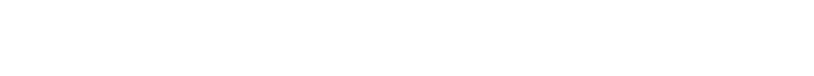

<!--suppress HtmlDeprecatedAttribute, HtmlUnknownTarget -->

  <!--
  =====================
         HEADER
  =====================
  -->
   
  <a rel="noopener noreferrer" href="https://github.com/OctalMesh/Commodore">
    <picture>
      <source media="(prefers-color-scheme: light)" srcset="./.github/assets/svg/commodore.svg">
      
    </picture>
  </a>
     
  <!--
  =====================
         BADGES
  =====================
  -->
  

    <!-- Repo Stars Badge -->
    <a rel="noopener noreferrer" href="https://github.com/OctalMesh/Commodore/stargazers">
      <picture>
        <source media="(prefers-color-scheme: light)" srcset="https://img.shields.io/github/stars/OctalMesh/Commodore?style=for-the-badge&logo=starship&color=363636&labelColor=464646" />
        
      </picture>
    </a>
    <!-- Repo Contributors Badge -->
    <a rel="noopener noreferrer" href="https://github.com/OctalMesh/Commodore/contributors">
      <picture>
        <source media="(prefers-color-scheme: light)" srcset="https://img.shields.io/github/contributors/OctalMesh/Commodore?style=for-the-badge&logo=githubsponsors&logoColor=fff&color=363636&labelColor=464646" />
        
      </picture>
    </a>
    <!-- Repo Views Badge -->
    <a rel="noopener noreferrer" href="https://hits.sh/github.com/OctalMesh/Commodore">
      <picture>
        <source media="(prefers-color-scheme: light)" srcset="https://hits.sh/github.com/OctalMesh/Commodore.svg?style=for-the-badge&label=Views&logo=github&color=363636&labelColor=464646" />
        
      </picture>
    </a>
  

  <h1></h1>
  <!--
  =====================
         SOURCES
  =====================
  -->
  <h6>
     
    <a rel="noopener noreferrer" href="CODE_OF_CONDUCT.md">Code of Conduct</a>
    ·
    <a rel="noopener noreferrer" href="CONTRIBUTING.md">Contributing</a>
    ·
    <a rel="noopener noreferrer" href="SECURITY.md">Security Policy</a>
    ·
    <a rel="noopener noreferrer" href="SUPPORT.md">Support</a>
    ·
    <a rel="noopener noreferrer" href="LICENSE.md">License</a>
  </h6>
  <!--
  =====================
       DESCRIPTION
  =====================
  -->
  

	  

      <strong>Commodore</strong> is a role-driven CLI engine and Go SDK for
      building and orchestrating OctalMesh projects from a shared
      <code>.commodore</code> configuration. It provides a consistent runtime
      for platform-level foreman CLIs, module-level brigadier CLIs, and worker
      CLIs, with role discovery driven by the current project.
	      
	    Built in <strong>Go</strong>, Commodore standardizes core workflows such
      as <em>up</em>, <em>down</em>, <em>doctor</em>, <em>modules</em>,
      delegated <em>hire</em> commands, and brigadier proxy commands, while
      keeping project-specific behavior extensible through the public SDK. It is
      the shared operational layer used to orchestrate Tilt-based development
      environments, module tooling, and command delegation across OctalMesh
      repositories.
	  

	

   
  <!--
  =====================
        ACTIVITY
  =====================
  -->
  <h1>Activity</h1>
  
    
  <!--
  =====================
         FOOTER
  =====================
  -->
  <h1></h1>
   
  <!-- OctalMesh Logo -->
  <a rel="noopener noreferrer" target="_blank" href="https://octalmesh.com">
    <picture>
      <source media="(prefers-color-scheme: light)" srcset="https://raw.githubusercontent.com/OctalMesh/OctalDesign/release/assets/logo/svg/octal_mesh_center.svg" />
      
    </picture>
  </a>
    
  <!-- Socials -->
  

    <!-- Telegram Badge -->
    <a rel="noopener noreferrer" target="_blank" href="https://octalmesh.com/telegram">
      <picture>
        <source media="(prefers-color-scheme: light)" srcset="https://raw.githubusercontent.com/OctalMesh/OctalDesign/release/assets/icon/svg/telegram.svg" />
        
      </picture>
    </a>
    &nbsp;
    <!-- YouTube Badge -->
    <a rel="noopener noreferrer" target="_blank" href="https://octalmesh.com/youtube">
      <picture>
        <source media="(prefers-color-scheme: light)" srcset="https://raw.githubusercontent.com/OctalMesh/OctalDesign/release/assets/icon/svg/youtube.svg" />
        
      </picture>
    </a>
    &nbsp;
    <!-- TikTok Badge -->
    <a rel="noopener noreferrer" target="_blank" href="https://octalmesh.com/tiktok">
      <picture>
        <source media="(prefers-color-scheme: light)" srcset="https://raw.githubusercontent.com/OctalMesh/OctalDesign/release/assets/icon/svg/tiktok.svg" />
        
      </picture>
    </a>
    &nbsp;
    <!-- Instagram Badge -->
    <a rel="noopener noreferrer" target="_blank" href="https://octalmesh.com/instagram">
      <picture>
        <source media="(prefers-color-scheme: light)" srcset="https://raw.githubusercontent.com/OctalMesh/OctalDesign/release/assets/icon/svg/instagram.svg" />
        
      </picture>
    </a>
    &nbsp;
    <!-- X Badge -->
    <a rel="noopener noreferrer" target="_blank" href="https://octalmesh.com/x">
      <picture>
        <source media="(prefers-color-scheme: light)" srcset="https://raw.githubusercontent.com/OctalMesh/OctalDesign/release/assets/icon/svg/x.svg" />
        
      </picture>
    </a>
    &nbsp;
    <!-- Reddit Badge -->
    <a rel="noopener noreferrer" target="_blank" href="https://octalmesh.com/reddit">
      <picture>
        <source media="(prefers-color-scheme: light)" srcset="https://raw.githubusercontent.com/OctalMesh/OctalDesign/release/assets/icon/svg/reddit.svg" />
        
      </picture>
    </a>
  

  <h6>
    • • •
      
    This project is licensed under the <a rel="noopener noreferrer" href="LICENSE.md">MIT License</a>
      
    <ul align="justify">
      <li>Feel free to use this project for any purpose, including commercial applications.</li>
      <li>You are permitted to modify, distribute, and include this project in any form, as long as the original copyright notice is retained.</li>
      <li>If you share or publish modified versions, attribution to the original <a rel="noopener noreferrer" href="https://github.com/OctalMesh/Commodore">GitHub repository</a> is appreciated.</li>
      <li>This software is provided "as is", without any warranties or guarantees, as detailed in the license terms.</li>
    </ul>
  </h6>

